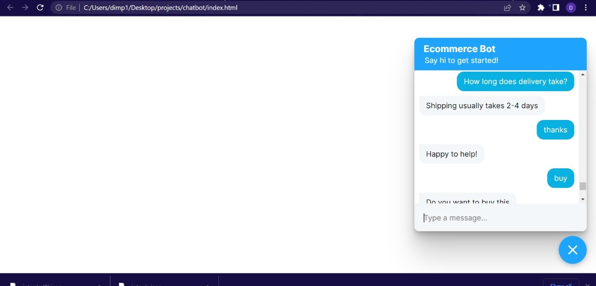

# Rebooting-Rebels
<h1 align="center" >Redefining E-Commerce</h1>

   

Let's build a E-commerce application that has a very interactive interface for the user, like a chatbot.

## ✌&ensp;Preview

|              Preview             |
| :----------------------------------:|
| |
| |
| |
| |

## 💻&ensp;Contributors
->
<a href= "https://www.linkedin.com/in/v-varun-pingale-2902571b2//">V Varun Pingale</a>

->
<a href= "https://www.linkedin.com/in/divya-j-365b28225/">Divya J</a>

->
<a href="https://www.linkedin.com/in/dimple-k-1b69b0191/" >Dimple K</a>

->
<a href= "https://www.linkedin.com/in/anurag-de-404s-retr0/">Anurag De</a>
